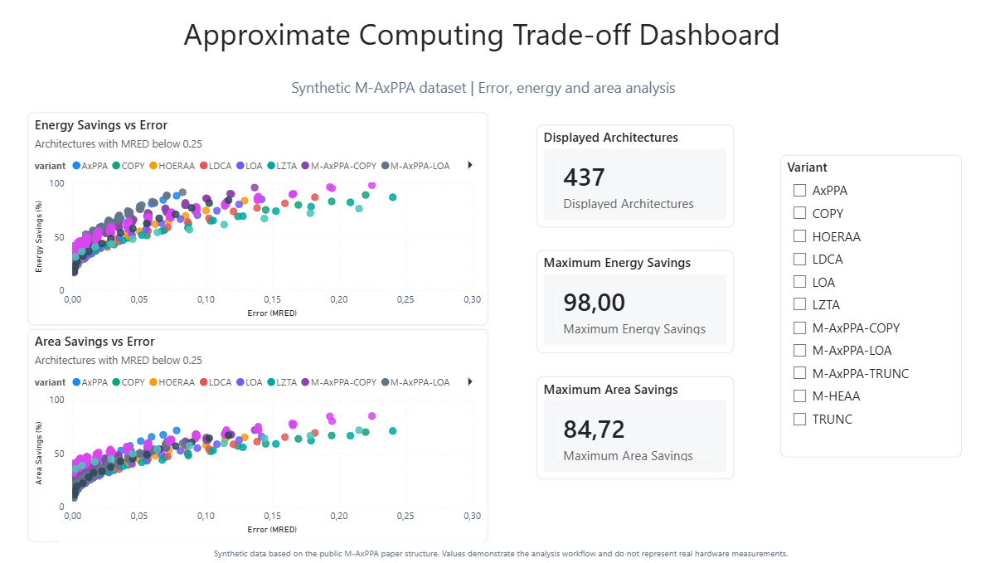

# Approximate Computing Trade-off Explorer

Data analytics project inspired by the public paper **M-AxPPA: Modified Approximate Parallel Prefix Adder**.

The goal is to analyze approximate adder architectures and answer one central question:

> Given an acceptable error threshold, which architectures provide the best energy and area savings?



## Live Dashboard

Access the interactive Streamlit dashboard:

[Open live app](https://m-axppa-tradeoff-analysis.streamlit.app/)

## Power BI Analysis

This project includes a Power BI dashboard designed to compare approximate
adder architectures by:

- energy savings;
- area savings;
- error threshold;
- architecture variant;
- balanced trade-off score.

The dashboard was built from a curated Excel dataset generated with Python.
This makes the project useful both as an engineering analysis and as a BI
portfolio case.

## Analytical Questions

The analysis is guided by decision-oriented questions:

1. Which architectures maximize energy savings under `MRED <= 0.10`?
2. Which architectures maximize area savings under `MRED <= 0.10`?
3. Which variants dominate the Pareto frontier?
4. How does the best architecture change when the decision criterion changes?
5. Which configurations offer the best balanced trade-off?

Full page: [`docs/analytical_questions.md`](docs/analytical_questions.md)

## Project Status

This is a public portfolio V1.

The current dataset is **synthetic** and was generated from the public structure described in the M-AxPPA paper. It is intended to demonstrate the analytics workflow, not to claim real hardware measurements.

Synthetic dataset scope:

- `W = 16` bits;
- 3 M-AxPPA variants: `COPY`, `TRUNC`, and `LOA`;
- 105 `(M, L, K)` configurations per M-AxPPA variant;
- 315 M-AxPPA architectures;
- 128 literature baseline configurations;
- 443 architectures in total;
- accuracy, error, energy, and area metrics prepared for SQL, Python, Power BI, and Streamlit analysis.

## Confidentiality Note

Current unpublished research involving DCT is intentionally excluded from this repository. This project only uses public paper information and clearly labeled synthetic data.

## What This Project Demonstrates

- Experimental data modeling.
- SQL analysis with SQLite.
- Python data generation and preparation.
- Multi-objective trade-off analysis.
- Pareto candidate analysis for error-energy and error-area decisions.
- Power BI dashboard design.
- Streamlit interactive dashboard.
- Technical storytelling for data portfolio.

## Main Insight

The best architecture depends on the decision criterion.

An architecture can maximize energy savings but produce too much error. Another can preserve accuracy but save less area. The useful workflow is:

```text
1. Filter architectures by acceptable error.
2. Rank the remaining candidates by energy savings, area savings, or balanced score.
3. Compare architecture families and approximation strategies.
```

The project also highlights **Pareto candidates** to identify architectures
that are not dominated in error-energy and error-area trade-offs.

## Dashboard

The Power BI dashboard compares:

- error (`MRED`) vs energy savings;
- error (`MRED`) vs area savings;
- displayed architectures after filtering;
- maximum energy savings;
- maximum area savings;
- architecture variants through an interactive slicer.

Power BI file:

```text
powerbi/M_AxPPA_Tradeoff_Dashboard.pbix
```

Power BI dataset:

```text
powerbi/m_axppa_powerbi_dataset.xlsx
```

## Repository Structure

```text
data/
  synthetic/          Synthetic normalized tables
  processed/          Unified processed dataset
database/
  schema.sql          Relational schema
  queries/            SQL analysis queries
dashboard/
  app.py              Streamlit dashboard
docs/
  analytical_questions.md
  resumo_do_artigo.md
  metodologia_dados_sinteticos.md
powerbi/
  M_AxPPA_Tradeoff_Dashboard.pbix
  m_axppa_powerbi_dataset.xlsx
  theme_m_axppa_tradeoff.json
portfolio/
  estudo_de_caso_v1.md
src/
  data_generation/
    generate_synthetic_data.py
  prepare_powerbi_dataset.py
  run_query.py
reports/
  figures/
    dashboard_v1.png
```

## How To Generate The Data

```bash
python src/data_generation/generate_synthetic_data.py
```

This creates:

- `data/synthetic/architectures.csv`
- `data/synthetic/accuracy_metrics.csv`
- `data/synthetic/synthesis_metrics.csv`
- `data/processed/tradeoff_dataset.csv`
- `database/m_axppa_synthetic.sqlite`

## How To Prepare The Power BI Dataset

```bash
python src/prepare_powerbi_dataset.py
```

This creates:

- `powerbi/m_axppa_powerbi_dataset.csv`
- `powerbi/m_axppa_powerbi_dataset.xlsx`
- `powerbi/resultados_resumo.csv`
- `powerbi/resultados_resumo.xlsx`

## How To Run SQL Queries

Example:

```bash
python src/run_query.py database/queries/03_energia_mred_010.sql
```

Example question:

> Which architectures maximize energy savings while keeping `MRED <= 0.10`?

Related queries:

```text
database/queries/02_energia_mred_005.sql
database/queries/03_energia_mred_010.sql
database/queries/05_candidatas_pareto.sql
database/queries/06_melhor_area_mred_010.sql
```

## How To Run The Streamlit Dashboard

Install dependencies:

```bash
pip install -r requirements.txt
```

Run:

```bash
streamlit run dashboard/app.py
```

## Tools

- Python
- Pandas
- SQLite
- SQL
- Power BI
- Streamlit
- Plotly

## Limitations

The current values are synthetic and should not be interpreted as real hardware measurements.

The project is designed to demonstrate the data workflow and can be extended with real experimental data if public disclosure becomes possible.

## Next Steps

- Improve Streamlit dashboard layout and add documentation for the deployed version.
- Add Python notebooks for exploratory data analysis.
- Improve the Power BI dashboard with a second page for ranking.
- Translate supporting documentation to English.
